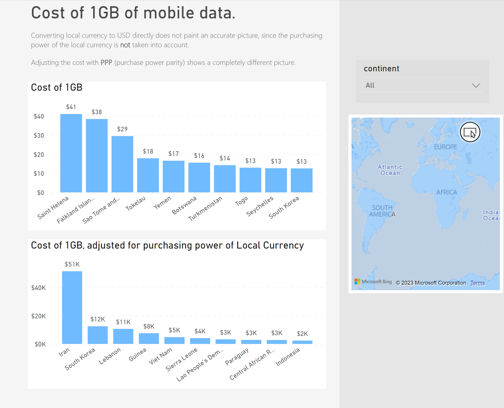

# Cost of 1GB of mobile data around the world

**Data sources:** [cable.co.uk](https://www.cable.co.uk/mobiles/worldwide-data-pricing/), [world bank](https://data.worldbank.org/indicator/PA.NUS.PPP)

# Inspiration

While browsing Visual Capitalist's visualization of the cost of mobile data around the world [(link)](https://www.visualcapitalist.com/cost-of-mobile-data-worldwide/), I noticed something that caught my attention. Upon closer inspection, I realized that the data did not accurately reflect the purchasing power of each currency in its respective country. This sparked my curiosity and I decided to delve deeper into the issue.

Through some research, I discovered the concept of Purchase Power Parity (PPP). PPP is a measure of the purchasing power of each currency in its own country, taking into account the cost of living and inflation. I realized that by adjusting the prices using PPP, I could create a more accurate representation of the data.

Excited to test my hypothesis, I applied PPP to the prices and was pleased to see that my hunch was correct. This project allowed me to not only expand my knowledge of data analysis, but also to make a meaningful contribution to the understanding of the cost of mobile data around the world.

## My Remake

## Visual Capitalist viz

